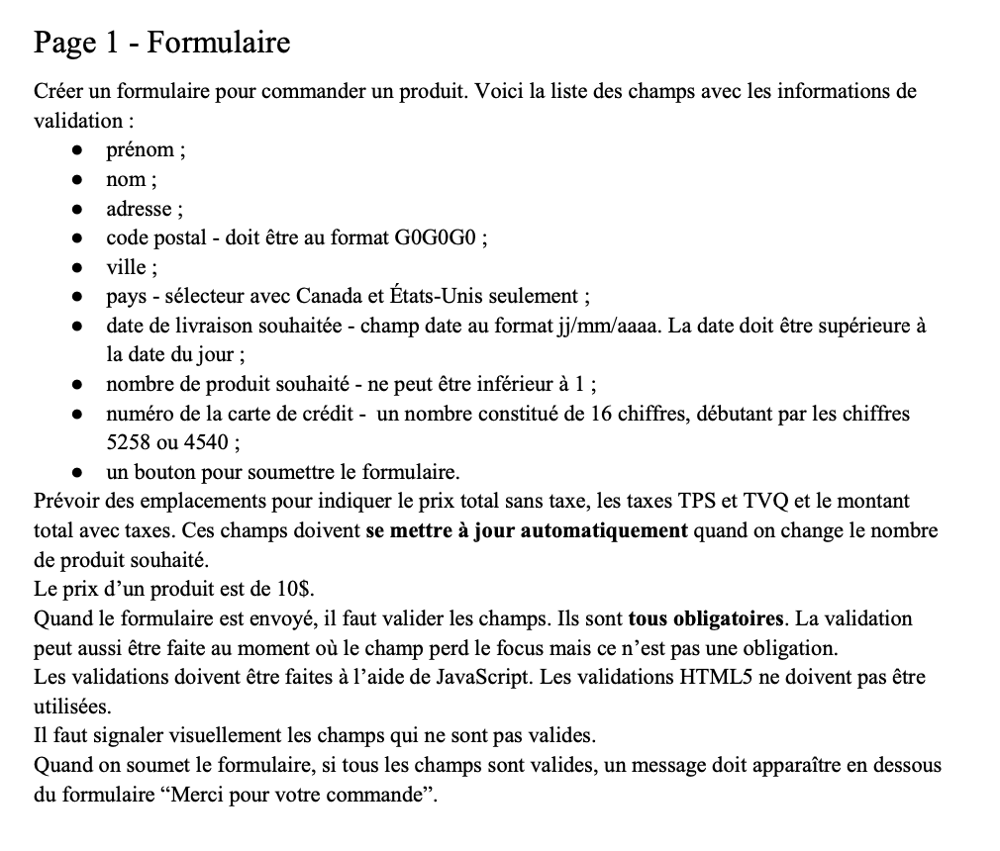
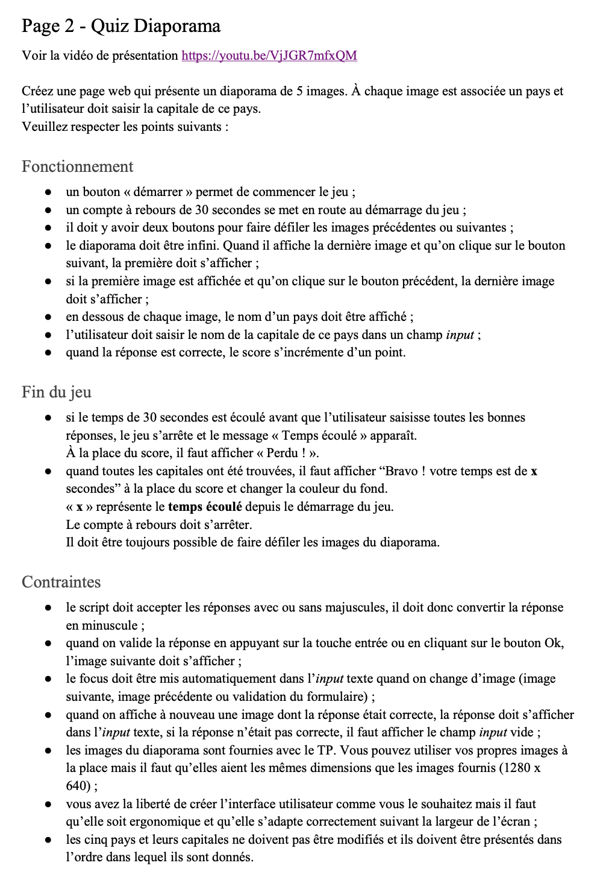

# Description 

Projet réalisé en équipe de 2 dans le cadre de mon AEC en développement web. 

Nous devions créer un site web de deux pages. La première présente un formulaire et la deuxième un  quiz diaporama. Les pages doivent avoir un menu pour naviguer d’une page à l’autre.

# Démonstration du projet 

[Formulaire](https://shweeby.ca/portfolio/projets/aec-sess2-prog-projet5/formulaire.html)

[Quiz](https://shweeby.ca/portfolio/projets/aec-sess2-prog-projet5/quizz.html)